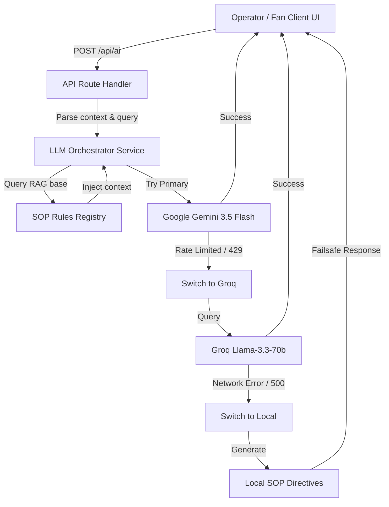

<div align="center">
  
  <h1>🏟️ ArenaMind AI</h1>
  <p><b>The Generative AI Operating System for FIFA World Cup 2026 Stadiums</b></p>
</div>

---

## 📌 Problem Statement

Modern stadiums are equipped with mature digital systems (CCTV cameras, ticket scanners, parking meters, dynamic signage, IoT sensors, and transport logs). However, **these systems rarely communicate intelligently with one another**:

*   **Siloed Infrastructure**: Operational teams lack a unified view of stadium conditions. Security, medical, transport, and volunteer divisions work in isolation.
*   **Reactive Decision-Making**: Current platforms only detect issues (such as gate congestion or medical emergencies) after they have already escalated. There is no predictive intelligence to alert coordinators before bottlenecking becomes dangerous.
*   **Disconnected Fan Services**: Spectators rely on fragmented applications for ticketing, wayfinding, transit, and customer service. Support is reactive, leading to lower spectator satisfaction.
*   **Manual Operational Latency**: Emergency dispatches and resource reassignments rely heavily on static SOP manuals and manual communication loops, costing critical seconds.

---

## 💡 Proposed Solution & Product Vision

ArenaMind AI acts as **an intelligence orchestration layer** that sits on top of the entire stadium ecosystem. By fusing digital twin technology, real-time event telemetry, and multi-model Generative AI, it transforms stadium management from **reactive monitoring** into **proactive operational intelligence**. 

Instead of asking *"What is happening?"*, operators begin asking *"What is likely to happen next?"*

---

## ⚡ Unique Selling Proposition (USP) & Innovations

What makes ArenaMind AI completely unique and different from standard dashboards or chatbots:

1.  **SOP-Grounded Decision Engine (RAG)**: Leverages Retrieval-Augmented Generation grounded with real FIFA Security, Emergency, and Gate Policy SOPs. Recommendations are never generic; they are directly mapped to active venue protocols.
2.  **Explainable AI Framework**: The platform generates non-black-box recommendations. Every operational alert outlines:
    *   *Diagnostic Status* (Situation assessment)
    *   *Operational Analysis* (2-3 key driving factors)
    *   *Mitigation Recommendations* (Numbered action list with expected impact percentages)
    *   *AI Confidence Score* (85-99%) and *Data Sources* used.
3.  **Role-Based Prompt & Persona Routing**: The gateway automatically customizes prompts based on user roles (Security, Medical, Volunteer, Executive, or Fan). Operators get technical dispatch screens, while fans get friendly wayfinding info in their native language (e.g. English, Spanish).
4.  **Resilient Dual-Model API Gateway**: Features an automatic, serverless Gemini-to-Groq fallback pipeline. If the primary Gemini 3.5 Flash API encounters rate limits, the system switches to Groq Llama 3.3 in milliseconds, guaranteeing zero downtime.
5.  **Strict Security Sandboxing**: API credentials and Firebase database secrets are wrapped strictly in server-side Next.js route handlers, keeping critical keys hidden from the client browser.

---

## 🛠️ Technological Stack

Consistent with the **Technical Architecture & Engineering Specifications**, ArenaMind AI implements:

### Frontend (Presentation & Rendering)
*   **Next.js 15 & React 19**: Framework utilizing Server Components and client-side rendering.
*   **React Three Fiber & Three.js**: WebGL digital twin canvas rendering the interactive 3D stadium layout.
*   **Drei**: Three.js helper components mapping interactive seat densities and coordinate meshes.
*   **Zustand**: Lightweight global state management.
*   **Tailwind CSS**: Sleek, glassmorphic layout system.
*   **Framer Motion & GSAP**: GPU-accelerated micro-animations and cinematic intro sequences.
*   **Recharts**: Real-time analytical charting for executive dashboards.

### Backend, Data, & Infrastructure
*   **Serverless API Gateway (Next.js API Routes)**: Centralized entrypoint managing input validation, prompt assembly, and model selection.
*   **Cloud Firestore**: Real-time NoSQL database syncing ticketing scanners, active incidents, and volunteer locations.
*   **Firebase Authentication**: Secure role-based operator authentication.
*   **Firebase Storage**: File bucket for avatar image uploads and digital twin model assets.
*   **WebSocket Protocol**: Live telemetry broadcasts push updates directly to connected screens.

### Artificial Intelligence & Cognitive Layer
*   **Google Gemini 3.5 Flash**: Primary reasoning model executing complex operational queries and incident assessments.
*   **Groq (Llama-3.3-70b-versatile)**: Automatic fallback LLM serving low-latency completions when Gemini limits are reached.
*   **RAG (Retrieval-Augmented Generation)**: Vector search parsing regional stadium layouts, maps, and FIFA SOP guidelines.

---

## 🤖 AI Orchestration Pipeline



---

## 📅 Chronological Development Sprint (24-Hour Roadmap)

ArenaMind AI was engineered and deployed during a single, high-intensity 24-hour sprint:

```
[00:00 - 04:00] ─── High-Fidelity 3D UI & WebGL Digital Twin Setup
[04:00 - 08:00] ─── Firebase Authentication & Real-time Operations Database
[08:00 - 12:00] ─── Server-Side API Gateway & Dual-Model LLM Fallback (Gemini + Groq)
[12:00 - 16:00] ─── Context Persona Routing (Structured Operator Logs vs. Conversational Fan Assist)
[16:00 - 20:00] ─── Anti-Hallucination SOP Guards & Security Key Exclusions
[20:00 - 24:00] ─── End-to-End Browser Verification & Vercel Deployment
```
