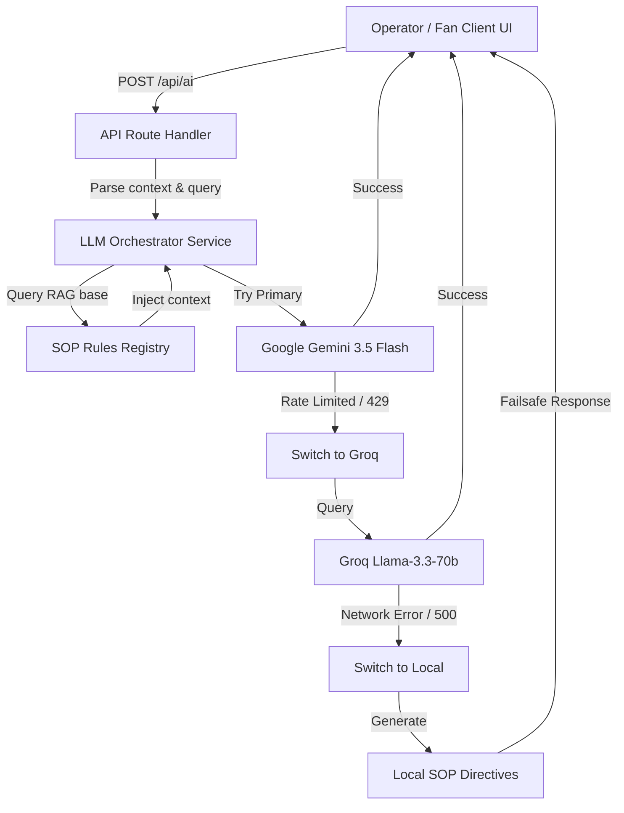

<div align="center">
  
  <h1>🏟️ ArenaMind AI</h1>
  <p><b>The Generative AI Operating System for FIFA World Cup 2026 Stadiums</b></p>
</div>

---

## 📌 Problem Statement

Managing massive stadium events like the FIFA World Cup 2026 presents a massive logistical challenge:
*   **Data Fragmentation**: Operations, ticketing, transport, medical dispatch, and fan support operate in disconnected silos.
*   **Crowd Safety & Bottlenecks**: Crowd densities change in minutes, causing queue delays and high-risk gate congestions.
*   **Unprepared Support Systems**: Standard fan assistants are basic text chatbots that hallucinate information and fail to provide multilingual support during critical moments.
*   **Operator Latency**: Critical incident dispatchers rely on manual SOP lookups, increasing emergency response times.

**ArenaMind AI** solves this by consolidating stadium data into an interactive, real-time command cockpit, integrating interactive 3D twins, smart navigation routers, and a secure server-side AI gateway.

---

## 🛠️ Technological Stack

ArenaMind AI is engineered using high-performance web and cloud technologies:

<table align="center">
  <tr>
    <td align="center" width="160">
      <svg width="64" height="64" viewBox="0 0 180 180" fill="none" xmlns="http://www.w3.org/2000/svg">
        <circle cx="90" cy="90" r="90" fill="black"/>
        <path d="M149.508 153L77.0143 53.649H63V126.351H74.4539V70.7303L135.807 153H149.508Z" fill="white"/>
        <rect x="119.546" y="53.649" width="11.4539" height="72.7022" fill="white"/>
      </svg>
      <br/><b>Next.js 15.5</b>
    </td>
    <td align="center" width="160">
      <svg width="64" height="64" viewBox="0 0 116 116" fill="none" xmlns="http://www.w3.org/2000/svg">
        <path d="M57.5 0L115 100H0L57.5 0Z" fill="white"/>
      </svg>
      <br/><b>Vercel</b>
    </td>
    <td align="center" width="160">
      <svg width="64" height="64" viewBox="0 0 256 351" fill="none" xmlns="http://www.w3.org/2000/svg">
        <path d="M0 282.9L24.8 120.3L97.9 311.6L0 282.9Z" fill="#FFC24C"/>
        <path d="M181.1 33.6L129.4 120.3L97.9 311.6L181.1 33.6Z" fill="#F48120"/>
        <path d="M129.4 120.3L256 282.9L181.1 33.6L129.4 120.3Z" fill="#DE4C1F"/>
      </svg>
      <br/><b>Firebase 12.16</b>
    </td>
    <td align="center" width="160">
      <svg width="64" height="64" viewBox="0 0 256 256" fill="none" xmlns="http://www.w3.org/2000/svg">
        <path d="M128 0L238.85 64V192L128 256L17.15 192V64L128 0Z" fill="black"/>
        <path d="M128 28L215 78.2V177.8L128 228L41 177.8V78.2L128 28Z" fill="#00F5FF"/>
      </svg>
      <br/><b>Three.js</b>
    </td>
  </tr>
</table>

---

## ✨ Core Features

*   **🌐 AI Command Center**: Centralized console for monitoring gates, emergency response, and operational indicators.
*   **🏟️ 3D Digital Twin**: WebGL/Three.js-powered stadium canvas plotting dynamic crowd volumes, ticket logs, and queue overlays.
*   **👥 Crowd Prediction & Management**: Estimations of egress timelines, wait times, and zone occupancy.
*   **🗺️ Smart Fan Navigation**: Map visuals displaying pathfinding patterns and gate redirections.
*   **🌍 Multilingual Fan Assistant**: Customer portal resolving navigation and transit queries across multiple language options.
*   **🚌 Transport Intelligence**: Dynamic telemetry mapping shuttle buses, metro flows, and parking.
*   **♿ Accessibility Copilot**: Central tracker for elevators, ramps, and dedicated helper dispatches.
*   **🚑 Emergency Response Copilot**: Fast incident logger routing hazards directly to first responders.
*   **🌱 Sustainability Insights**: Monitoring dashboard for energy consumption, HVAC usage, and recycling metrics.

---

## ⚡ Unique Selling Proposition (USP)

What makes ArenaMind AI different from standard solutions:

1.  **Dual-Model Failover Architecture**: If Gemini API quotas are exhausted, the server transparently falls back to Groq Llama 3.3 in milliseconds, keeping operations active.
2.  **Context Persona Split**: It divides response rendering: operators get structured technical diagnostics (`**DIAGNOSTIC STATUS**: ...`), while fans get conversational, helpful wayfinding text in their preferred language.
3.  **Strict Anti-Hallucination Controls**: Utilizes zero-temperatures (`0.1`) and strict SOP validation guards to prevent incorrect recommendations.
4.  **Security Wrapping**: All AI queries are securely executed server-side via Next.js routes, hiding sensitive keys from browser bundles.

---

## 🤖 AI Orchestration Engine

The ArenaMind AI engine routes incoming client requests through a secure server-side API Gateway to select and execute the most efficient generative model:



---

## 📅 Chronological Working Sprint (24-Hour Roadmap)

ArenaMind AI was designed, built, and deployed in a single, high-intensity 24-hour sprint:

```
[00:00 - 04:00] ─── High-Fidelity 3D UI & WebGL Digital Twin Setup
[04:00 - 08:00] ─── Firebase Authentication & Real-time Operations Database
[08:00 - 12:00] ─── Server-Side API Gateway & Dual-Model LLM Fallback (Gemini + Groq)
[12:00 - 16:00] ─── Context Persona Routing (Structured Operator Logs vs. Conversational Fan Assist)
[16:00 - 20:00] ─── Anti-Hallucination SOP Guards & Security Key Exclusions
[20:00 - 24:00] ─── End-to-End Browser Verification & Vercel Deployment
```
