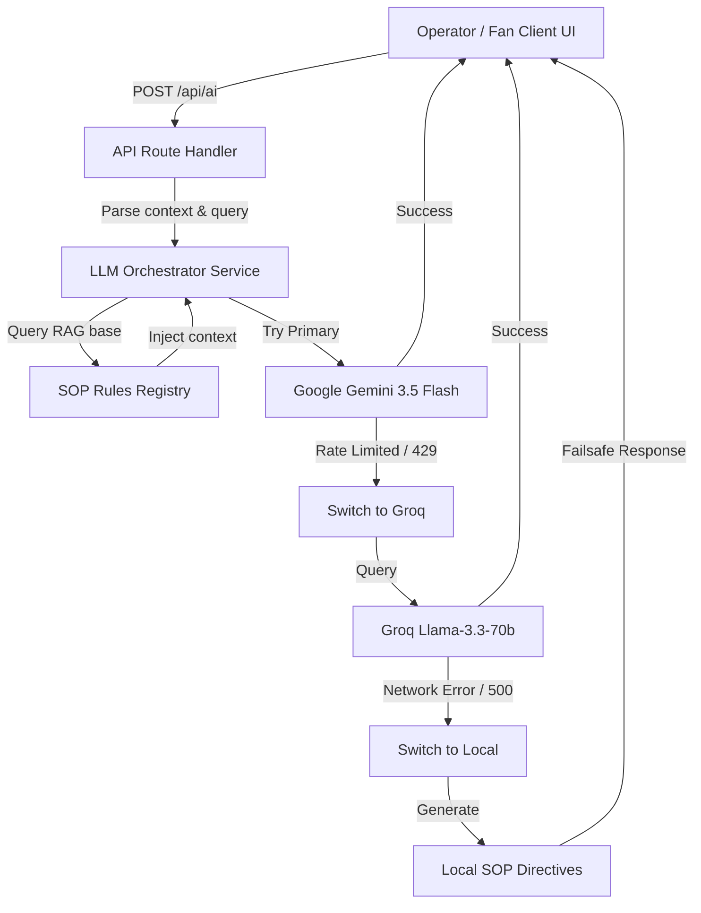

# 🏟️ ArenaMind AI

[](https://nextjs.org/)
[](https://tailwindcss.com/)
[](https://www.typescriptlang.org/)
[](https://firebase.google.com/)
[](https://threejs.org/)
[](https://vercel.com/)

> **Generative AI Operating System for FIFA World Cup 2026 Stadiums.**  
> ArenaMind AI fuses interactive 3D digital twins, real-time crowd analytics, and a secure dual-model LLM orchestrator to provide intelligent decision support for stadium operations, operator dispatch, and multilingual fan assistance.

Built for **PromptWars Virtual | Hack2Skills**.  
Created & Programmed by **Vaibhav Shaw** (Powered by **Visionary_Coders**).

---

## 🧠 Core System Modules

ArenaMind AI organizes stadium control into high-fidelity HUD interfaces accessible via the sidebar navigation:

*   **🌐 AI Command Center**: Real-time operational logs, interactive map overlays, and instant operator control.
*   **🏟️ Digital Twin (3D Stadium)**: Fully interactive WebGL/Three.js viewport mapping crowd volumes across zones, entry gates, and seating.
*   **👥 Crowd Prediction & Management**: ML-driven predictions estimating egress durations, sector densities, and queue delays.
*   **🗺️ Smart Fan Navigation**: Visualized routing and wayfinding maps directing traffic flow.
*   **🌍 Multilingual Fan Assistant**: Conversational portal assisting visitors with services and directions in multiple languages.
*   **🚌 Transport Intelligence**: Dynamic transit metrics, active shuttle updates, and rail capacity analysis.
*   **♿ Accessibility Copilot**: Real-time coordination of elevator/ramp states and special assistance requests.
*   **🚑 Emergency Response Copilot**: Incident dispatch console mapping emergencies directly to medical or security teams.
*   **🙋 Volunteer Coordination**: Reassignment queues and steward deployments using LIFO prioritization logic.
*   **🌱 Sustainability Insights**: Energy tracking grids monitoring HVAC efficiency and recycling statistics.
*   **📊 Executive Analytics Dashboard**: C-suite view consolidating ticket scans, gate loads, and operational KPIs.

---

## 🏗️ System Architecture

The ArenaMind AI engine routes all client requests through a secure server-side API Gateway to orchestrate generative models with local Standard Operating Procedures (SOPs).



---

## 🔒 Security & Key Protection

To protect API credentials and billing structures on production, ArenaMind AI implements strict **zero-exposure backend key wrapping**:
1. **Server-Side API Handler**: All AI model calls are wrapped inside Next.js server-side endpoint handlers (`/api/ai`).
2. **Private Env Variables**: Keys are stored on Vercel as private environment variables (`GEMINI_KEY` and `GROQ_KEY`) without the `NEXT_PUBLIC_` prefix, completely preventing browser exposure.
3. **Prompt Injection Shield**: A safety logic layer parses inputs to filter and intercept system bypass attempts.
4. **Deterministic Guardrails**: Both models run at a low temperature of `0.1` and are grounded strictly with local retrieved rules to prevent hallucinations.

---

## 🚀 Getting Started

### Prerequisites
*   Node.js (v18.0.0 or later)
*   npm (v9.0.0 or later)

### Installation
1.  Clone the repository:
    ```bash
    git clone https://github.com/visionary-code-studio/ArenaMind.git
    cd ArenaMind/arenamind
    ```
2.  Install dependencies:
    ```bash
    npm install --legacy-peer-deps
    ```
3.  Set up your Environment Variables by creating `.env.local` inside the `arenamind` folder:
    ```env
    # AI API Keys
    GEMINI_KEY=your_gemini_api_key
    GROQ_KEY=your_groq_api_key

    # Firebase Config
    NEXT_PUBLIC_FIREBASE_API_KEY=your_firebase_api_key
    NEXT_PUBLIC_FIREBASE_AUTH_DOMAIN=your_auth_domain
    NEXT_PUBLIC_FIREBASE_PROJECT_ID=your_project_id
    NEXT_PUBLIC_FIREBASE_STORAGE_BUCKET=your_storage_bucket
    NEXT_PUBLIC_FIREBASE_MESSAGING_SENDER_ID=your_sender_id
    NEXT_PUBLIC_FIREBASE_APP_ID=your_app_id
    ```
4.  Launch the development server:
    ```bash
    npm run dev
    ```
    *Open [http://localhost:3000](http://localhost:3000) to view the app in your browser.*

---

## 🌐 Deploy to Vercel

1. Link the repository to your Vercel Account.
2. In the project Settings, change the **Root Directory** from `./` to `arenamind`.
3. Add the API keys and Firebase variables inside Vercel's **Environment Variables** panel. Use `GEMINI_KEY` and `GROQ_KEY` directly (without the public prefix) for maximum security.
4. Click **Deploy**.

---

## 👤 Developer Profile

*   **Portfolio**: [vaibhavportfolio26.netlify.app](https://vaibhavportfolio26.netlify.app/)
*   **GitHub**: [@visionary-code-studio](https://github.com/visionary-code-studio)
*   **LinkedIn**: [Vaibhav Shaw](https://www.linkedin.com/in/vaibhav-shaw-55124835b/)
*   **Twitter/X**: [@vaibhavshawsnu](https://x.com/vaibhavshawsnu)
*   **Instagram**: [@designer.hub2025](https://www.instagram.com/designer.hub2025/)
